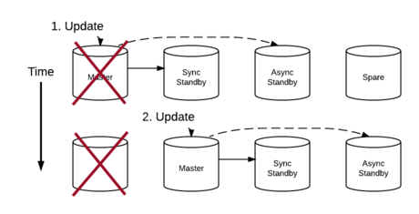

# [Ketch](https://github.com/watercraft/ketch)

Ketch is a [Go](http://www.golang.org) library and set of utilities to
manage a cluster of replicated databases. Ketch provided enhanced
reliability by configuring synchronous replication to a majority
within a quorum group and reconfiguring the group around failures.
The protocol for reconfiguring quorum groups is documented in the
KetchProtocol.pdf file that accompanies this project.



## Project Status

This project is under development and not ready for production
use. Contact watercraftsoftware@gmail.com for current status and
plans. The project is currently offered under the Mozzila 2.0 licence.

## Building

```
go install
```

## Usage

Ketch has been tested with independent Postgres servers that bind to
different IPs within the same Linux host.  Here are example entries for
/etc/hosts:

```
127.0.2.1	server1
127.0.2.2	server2
127.0.2.3	server3
127.0.2.4	server4
```

Note, a minimum of four servers is recommended to provide availability
in a Ketch configuration.

The CLI interfaces in Ketch can take a combination of environment
variables and command line arguments.  Here I'm setting environment
variables that are common to all four server instances:

```
# export KETCH_MEMBER_LIST=server1,server2,server3,server4
# export KETCH_DB_BIN_DIR=/usr/lib/postgresql/9.5/bin
```

And now I can start the servers:

```
# ketch --api-server server1 --data-dir ~/db/server1 run &
# ketch --api-server server2 --data-dir ~/db/server2 run &
# ketch --api-server server3 --data-dir ~/db/server3 run &
# ketch --api-server server4 --data-dir ~/db/server4 run &
```

We use ketchctl to create a database instance in the cluster:

```
# cat examples/samplereplica.yaml
data:
- attributes:
    name: mydb1
    quorumGroupSize: 3
    dbConfig:
      username: myuser
      password: mypassword
      port: 5432
      closedPort: 5433
  type: replica
# ketchctl login -s server1
# ketchctl create replica -f examples/samplereplica.yaml
...
```

After a short time the database can be used in the normal way:

```
# psql -h server1 -U myuser mydb1
```

Pending a planned integration with [SkyDNS](https://github.com/skynetservices/skydns)
you should be able to locate the service with the database name:

```
# psql -h mydb1.mydomain.com -U myuser mydb1
```

Ketchctl is also used to query local resources: runtime,
server, epoch, replica, and dbmbr.  For example, you can view the list
of connected instances of the ketch server:

```
# ketchctl get server
data:
- attributes:
    endpoint:
      addr: 127.0.2.1
      port: 7459
    id: 6fbacbae-2954-4472-9795-e59945f4d4b5
    name: server1
  id: 6fbacbae-2954-4472-9795-e59945f4d4b5
  type: server
- attributes:
    endpoint:
      addr: 127.0.2.2
      port: 7459
    id: 23becdbc-20db-4ddd-892c-31a77a0a1714
    name: server2
  id: 23becdbc-20db-4ddd-892c-31a77a0a1714
  type: server
...
```

Replicas represent the local copies of a database and have a 1-1
relation with dbmgr's which are non-persisted objects that track
execution of Postgres servers and utilities. Epochs server both the
epoch and lease parts of the Ketch protocol.  Runtime is a singleton
that persists state related to the local instance.

All Ketch state is stored under the '--data-dir' directory.  Ketch
objects are stored in a [Bolt](https://github.com/boltdb/bolt)
database called ketch.db while Postgres data is stored under a
subdirectory named by the Replica ID. Postgres socket/lock files are
stored directly under the '--data-dir' directory. Though a Replica
object in Ketch may be deleted for safety in the protocol, Postgres
data is always preserved for debugging and recovery.
